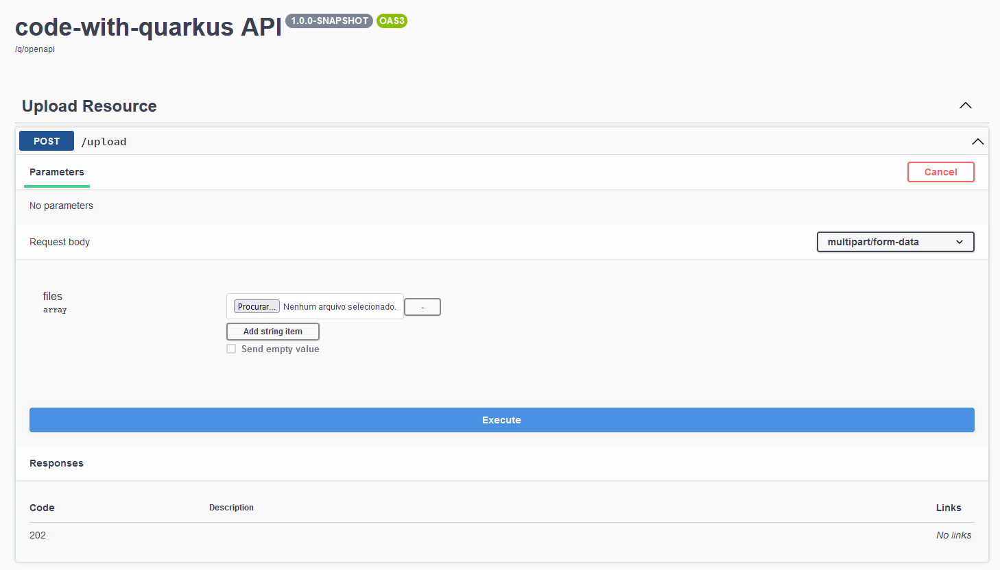
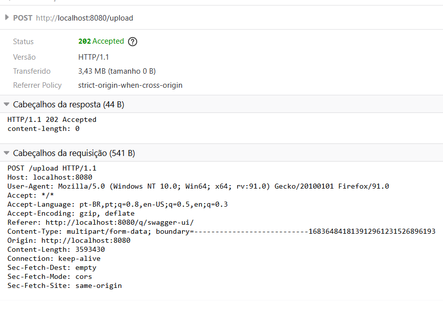
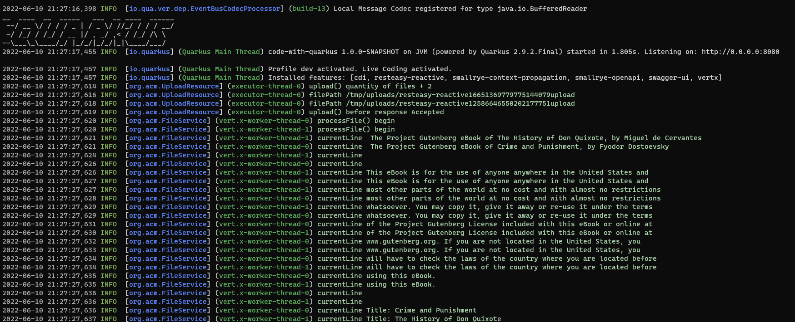

# Quarkus Swagger Upload File

Demo project where you can upload a file using the swagger. The endpoint, which is running on an executor thread, responds one 202 Accepted and send one event on a Vert.X Event Bus, that is processed on a worker thread asynchronously. 

[Maximillian Arruda](https://github.com/dearrudam) taught me how to upload a file with the Swagger UI, all the credits are him.

## Instructions to run

Start the application:
```shell script
./mvnw compile quarkus:dev
```

Access the swagger-ui at http://localhost:8080/q/swagger-ui

Add the files you want to upload (the assets folder has two files for test):


Click **execute**.

You'll receive one 202 Accepted.

The application sends the Buffer from the files to a Vert.X Bus Event, where they are processed and the information is displayed.

In the developer are of the browser (usually when you press F12), you can see the HTTP POST request with all data being sent to the server



In the logs of the application, you'll see that the HTTP endpoint is provided by by one `executor thread` and the processing of the file is done by one `worker thread`:




# code-with-quarkus Project

This project uses Quarkus, the Supersonic Subatomic Java Framework.

If you want to learn more about Quarkus, please visit its website: https://quarkus.io/ .

## Running the application in dev mode

You can run your application in dev mode that enables live coding using:
```shell script
./mvnw compile quarkus:dev
```

> **_NOTE:_**  Quarkus now ships with a Dev UI, which is available in dev mode only at http://localhost:8080/q/dev/.

## Packaging and running the application

The application can be packaged using:
```shell script
./mvnw package
```
It produces the `quarkus-run.jar` file in the `target/quarkus-app/` directory.
Be aware that it’s not an _über-jar_ as the dependencies are copied into the `target/quarkus-app/lib/` directory.

The application is now runnable using `java -jar target/quarkus-app/quarkus-run.jar`.

If you want to build an _über-jar_, execute the following command:
```shell script
./mvnw package -Dquarkus.package.type=uber-jar
```

The application, packaged as an _über-jar_, is now runnable using `java -jar target/*-runner.jar`.

## Creating a native executable

You can create a native executable using: 
```shell script
./mvnw package -Pnative
```

Or, if you don't have GraalVM installed, you can run the native executable build in a container using: 
```shell script
./mvnw package -Pnative -Dquarkus.native.container-build=true
```

You can then execute your native executable with: `./target/code-with-quarkus-1.0.0-SNAPSHOT-runner`

If you want to learn more about building native executables, please consult https://quarkus.io/guides/maven-tooling.

## Related Guides

- Eclipse Vert.x ([guide](https://quarkus.io/guides/vertx)): Write reactive applications with the Vert.x API
- SmallRye OpenAPI ([guide](https://quarkus.io/guides/openapi-swaggerui)): Document your REST APIs with OpenAPI - comes with Swagger UI
- RESTEasy Reactive ([guide](https://quarkus.io/guides/resteasy-reactive)): A JAX-RS implementation utilizing build time processing and Vert.x. This extension is not compatible with the quarkus-resteasy extension, or any of the extensions that depend on it.

## Provided Code

### RESTEasy Reactive

Easily start your Reactive RESTful Web Services

[Related guide section...](https://quarkus.io/guides/getting-started-reactive#reactive-jax-rs-resources)
